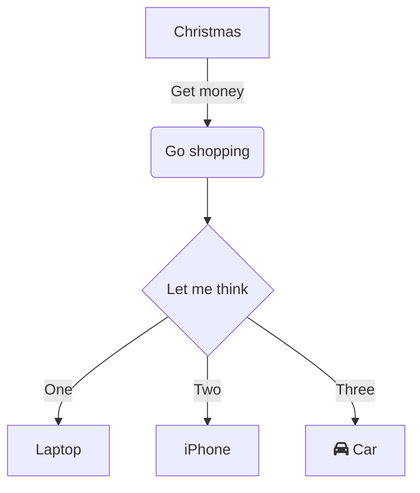

Features of Garden Garden...
[[Zettelkasten]]
### MDX
<div style={{ padding: '20px', backgroundColor: 'tomato' }}>
  <h3>This is JSX</h3>
</div>
### Mermaid Based Graphs




| Syntax      | Description |
| ----------- | ----------- |
| Header      | Title       |
| Paragraph   | Text        |


## Tasklist
 
* [ ] to do
* [x] done

$$
E=mc^2
$$

$x$ is in inline math

> A digital garden is an online space at the intersection of a notebook and a blog, where digital gardeners share seeds of thoughts to be cultivated in public. Contrary to a blog, where articles and essays have a publication date and start decaying as soon as they are published, a digital garden is evergreen: digital gardeners keep on editing and refining their notes.


## The Basics

You should be able to _do this_ and **this** - basic formatting options. Wierdly, there is no underline in markdown - so no need to do that.

Next, you should be able to create links - like [this](https://standup-philosophy.netlify.app/) - that link will go to the standup philosophy blog I have.

### Images


---
 


## Intermediate

> "You should be able to make stand out text like this"
> Source

### Lists

Two types of lists...

1. Ordered lists
2. Like this.
3. Because numbers.

And...

- Unordered lists
- like this
- No numbers.
- Just bullet points

### Code

You can put `code` in Markddown...

```c:title=example-file.c
#include <stdio.h>

void main() {
    cout<<"Hello World!"<<endl;
}
```

#### Bash Time

```bash{promptUser:user,promptHost:host}
#!/bin/bash

# Define source and destination directories. I increase the length of this lineeeeeeeeeeeeeeeeeeeeeeeeeeeeeeeeeeeeeeee
src_dir="/path/to/source"
dest_dir="/path/to/destination"

# Function to copy files
copy_files() {
  src_file=$1
  dest_file=$2
  cp "$src_file" "$dest_file"
}

# Iterate over each item in source directory
for item in "$src_dir"/*; do
  # If item is a file
  if [ -f "$item" ]; then
    echo "File found: $item"
    # Call the copy function
    copy_files "$item" "$dest_dir"
  # If item is a directory
  elif [ -d "$item" ]; then
    echo "Directory found: $item. Skipping."
  else
    echo "Unknown item: $item. Skipping."
  fi
done

echo "Done copying files."
echo "Done copying files."
echo "Done copying files."
echo "Done copying files."
echo "Done copying files."

```

This script copies only files, skipping over directories and other types of items. It's always a good idea to check the behavior of a script like this before running it on important data, to avoid unexpected results.

# Diff Code Blocks
```diff-javascript
-   function hello(name) {
-      console.log("Hello, " + name + "!");
-    }
+    hello = name => {
+      console.log(`Hello, ${name}!`);
+    }
```
# Prompt for Bash
```shell{promptUser: alice}{promptHost: dev.localhost}
echo "Hello, world!"
for i in {1..10};
do
  echo $i
done
```


# Prompt for Bash \#2
```shell{outputLines: 2, 4-8}{promptUser: chris}{promptHost: dev.remotehost}
pwd
/usr/home/chris/bin
ls -la
total 2
drwxr-xr-x   2 chris  chris     11 Jan 10 16:48 .
drwxr--r-x  45 chris  chris     92 Feb 14 11:10 ..
-rwxr-xr-x   1 chris  chris    444 Aug 25  2013 backup
-rwxr-xr-x   1 chris  chris    642 Jan 17 14:42 deploy
```


This is a paragraph with a footnote at the end. [^1]

Here's another sentence with a footnote. [^2]

[^1]: This is the first footnote.
[^2]: This is the second footnote. You can put as much text here as you like, including multiple paragraphs.