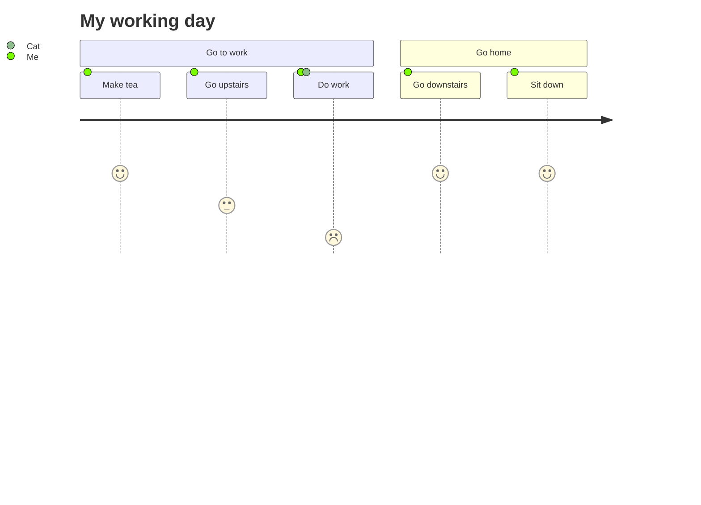
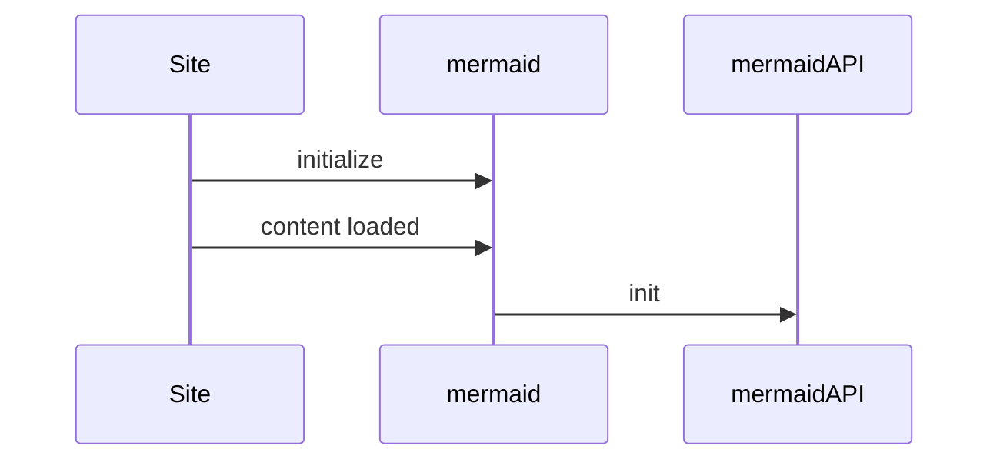
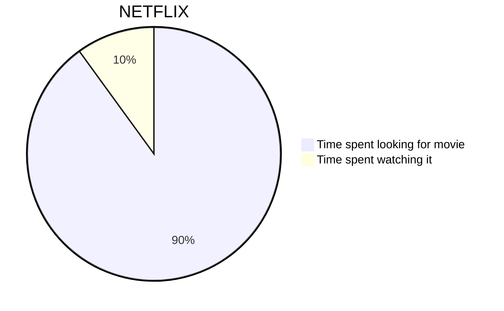

```toc
# This code block gets replaced with the TOC
```

Zettelkasten is a Note Taking Process and a Knowledge Management System. It has 3 types of notes…

- Fleeting notes: Temporary notes for remembering
- Literature Notes: Fleeting notes combined and cleanup. Will be a summary of the content.








# My Document


## Introduction
...

## Chapter 1
...

## Chapter 2
...